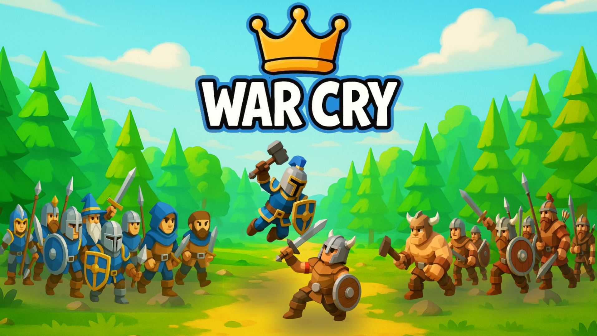
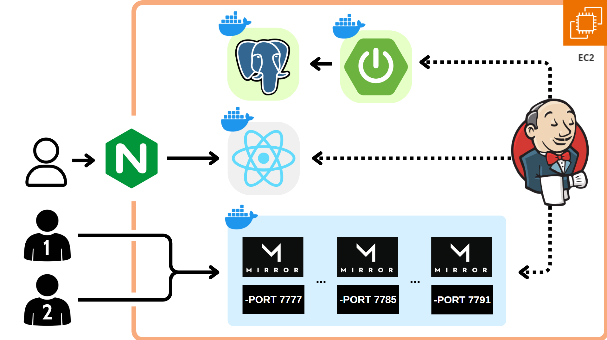
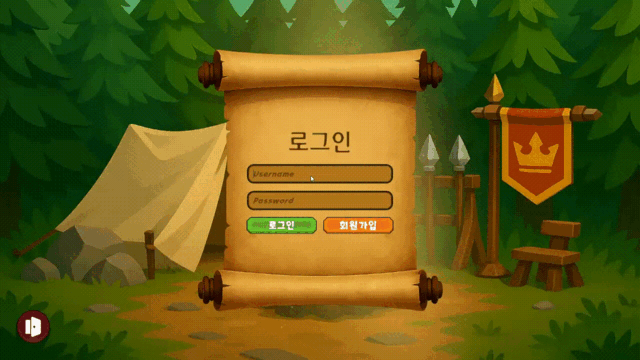
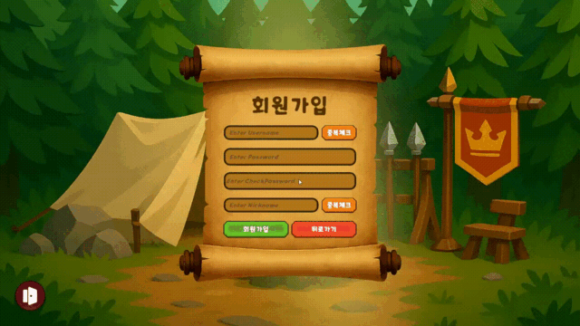
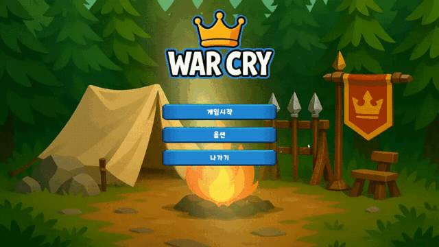
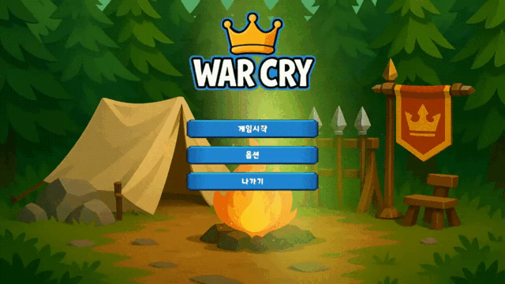
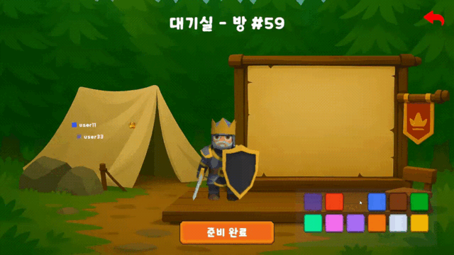
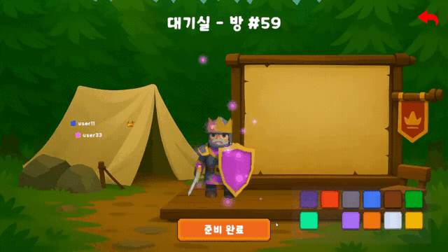
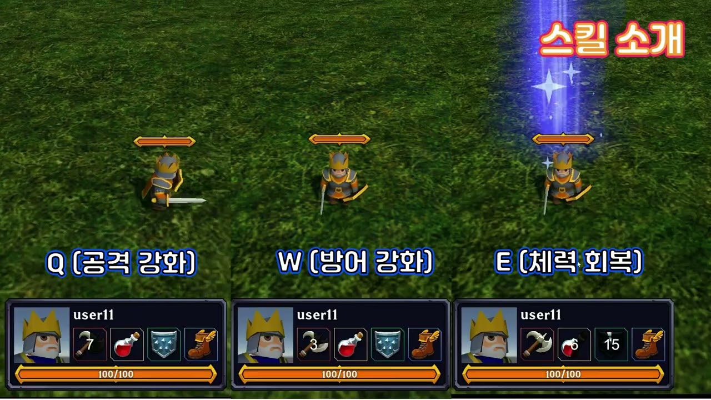

# WAR CRY

음성 명령으로 전략을 지시하는 실시간 전략 시뮬레이션 게임



## 📖 프로젝트 소개

음성을 통해 유닛을 제어하는 RTS 게임 WarCry입니다.

게임은 1vs1 pvp 형태로 진행됩니다.

### 🎯 핵심 특징

- **음성 명령 시스템**: UDP 통신 기반 외부 음성 인식 프로그램과 연동
- **실시간 1vs1 멀티플레이**: Dedicated 서버 기반 안정적인 대전 (Listen 서버 예비)
- **전략적 깊이**: 왕, 일반 유닛, 성 등 다양한 유닛 타입과 전술적 배치
- **계층적 유닛 시스템**: MinionUnit, KingUnit, Castle로 구분된 전투 로직
- **랭킹 시스템**: 티어 기반 경쟁 시스템으로 장기적인 플레이 동기 제공
- **다중 씬 구조**: 로그인, 메인메뉴, 방목록, 대기실, 전투, 결과 씬 지원

## 🏗 시스템 아키텍처

### 전체 구조


**Unity Client (게임 본체)**
- 실시간 1vs1 멀티플레이어 게임
- Mirror Networking 기반 네트워크 통신
- UDP 통신을 통한 음성 명령 처리
- 게임 플레이 로직 및 UI/UX

**Spring Boot API Server**
- 사용자 인증 및 계정 관리 (JWT)
- 매치메이킹 및 방 관리
- 랭킹 시스템 및 게임 결과 처리
- PostgreSQL 데이터베이스 연동
- Dedicated/Listen Server 관리

**Web Frontend (소개 페이지)**
- React 기반 게임 소개 웹사이트
- 실시간 랭킹 시스템 조회
- 유저 프로필 및 매치 히스토리
- 게임 다운로드 및 안내
### 서버 구조 (Hybrid)

#### Dedicated Server (메인)
- **중앙 서버**: AWS에서 관리되는 전용 게임 서버
- **GameServer Pool**: 사용 가능한 서버 자동 할당
- **장점**: 안정성, 치트 방지, 확장성
- **단점**: 서버 비용, 지연시간

#### Listen Server (예비)
- **HOST**: 플레이어의 Unity 클라이언트가 직접 서버 역할 수행
- **GUEST**: HOST 클라이언트에 직접 연결
- **장점**: 서버 비용 절감, 빠른 반응성
- **사용 시점**: Dedicated 서버 부족 시 또는 개발/테스트 용도

## 🛠 기술 스택

### Backend (API Server)
- **Framework**: Spring Boot
- **Database**: PostgreSQL
- **Authentication**: JWT
- **Game Server**: Dedicated Server Pool (AWS) + Listen Server (예비)
- **Build Tool**: Gradle

### Game Client (Unity)
- **Engine**: Unity 6000.0.41f LTS
- **Networking**: Mirror Networking (Dedicated + Listen Server 지원)
- **Voice System**: UDP 통신 + 외부 음성 인식 프로그램

### Web Frontend (소개 페이지)
- **Framework**: React 19.1.0
- **UI Libraries**: React Icons, Framer Motion
- **Charts**: Chart.js, React-ChartJS-2 (랭킹 시각화)
- **HTTP Client**: Axios
- **Routing**: React Router DOM
- **Date Utils**: date-fns

### Infrastructure


## 📁 프로젝트 구조

<details>
<summary>Backend (Spring Boot API Server)</summary>

```
warcry/
├── src/main/java/com/game/warcry/
│   ├── config/                           # 설정 파일
│   │   ├── DataInitializer.java          # 초기 데이터 설정
│   │   └── ProjectSecurityConfig.java    # 보안 설정
│   ├── controller/                       # REST API 컨트롤러
│   │   ├── AuthController.java           # 인증 관련 API
│   │   ├── ListenMatchController.java    # Listen Server 매치 API
│   │   ├── MatchController.java          # Dedicated Server 매치 API
│   │   └── RankController.java           # 랭킹 시스템 API
│   ├── dto/                              # 데이터 전송 객체
│   │   ├── listen/                       # Listen Server DTO
│   │   ├── match/                        # Match 관련 DTO
│   │   ├── rank/                         # 랭킹 시스템 DTO
│   │   └── auth...                       # 인증 관련 DTO
│   ├── model/                            # JPA 엔티티
│   │   ├── User.java                     # 사용자 엔티티
│   │   ├── Match.java                    # 매치 엔티티
│   │   ├── MatchUser.java                # 매치 참여자 엔티티
│   │   ├── GameServer.java               # 게임 서버 엔티티
│   │   ├── Rating.java                   # 랭킹 엔티티
│   │   ├── RatingHistory.java            # 랭킹 히스토리 엔티티
│   │   └── DailyStats.java               # 일일 통계 엔티티
│   ├── repository/                       # 데이터 액세스 계층
│   ├── security/jwt/                     # JWT 인증
│   ├── service/                          # 비즈니스 로직
│   └── WarcrybackApplication.java        # 메인 애플리케이션
├── src/main/resources/
│   ├── application-local.yml             # 로컬 환경 설정
│   └── application-prod.yml              # 프로덕션 환경 설정
├── build.gradle                          # 프로젝트 의존성
├── docker-compose.yml                    # Docker 구성
├── Dockerfile                            # Docker 이미지 빌드
└── Jenkinsfile                           # CI/CD 파이프라인
```
</details>
<details>
<summary>Unity Game Client (게임 본체)</summary>

```
Unity/WarCry
|-- Assets/                                             # 유니티 프로젝트 자산 폴더
|   |-- Scripts/                                        # 스크립트 폴더
|   |   |-- Army/                                       # 병력 애니메이션 관련
|   |   |   |-- AnimationEventHandler.cs                # 애니메이션 이벤트 처리
|   |   |   |-- AnimatorSetup.cs                        # 애니메이터 설정
|   |   |   |-- CommandProcessor.cs                     # 음성 명령 처리 및 유닛에 전달
|   |   |   |-- CubeMovement.cs
|   |   |   |-- EnemyDetector.cs                        # 적 감지 로직
|   |   |   |-- UDPListener.cs                          # UDP 통신으로 음성 명령 수신
|   |   |   |-- UnitController.cs                       # 유닛 이동 및 전투 로직 (deprecated)
|   |   |   └-- VoiceCommandLauncher.cs                 # 음성 명령 실행기 (외부 프로그램 실행)
|   |   |
|   |   |-- Audio/                                      # 오디오 관련 스크립트
|   |   |   └-- SoundManager.cs
|   |   |
|   |   |-- BattleScene/                                # 전투 장면 관련 스크립트
|   |   |   |-- Core/
|   |   |   |   |-- BattleController.cs
|   |   |   |   |-- BattleSceneInitializer.cs
|   |   |   |   └-- BattleSceneManager.cs
|   |   |   |
|   |   |   |-- Map/                                    # 전투 UI 관련 스크립트
|   |   |   |   └-- BattleMapGenerator.cs
|   |   |   |
|   |   |   |-- Spawner/                                # 유닛 생성 관련 스크립트
|   |   |   |   |-- BattleSpawner.cs
|   |   |   |   └-- PlacementManager.cs
|   |   |   |
|   |   |   |-- UI/                                     # 전투 UI 관련 스크립트
|   |   |   |   |-- Camera/
|   |   |   |   |   |-- CameraManager.cs
|   |   |   |   |   └-- PlayerPerspectiveManager.cs
|   |   |   |   |-- Canvas/
|   |   |   |   |   |-- AbilityCooldownHandler.cs
|   |   |   |   |   |-- BattlePhaseController.cs
|   |   |   |   |   |-- BattleUIManager.cs
|   |   |   |   |   |-- BillboardCanvas.cs
|   |   |   |   |   |-- PlayerStatsDisplay.cs
|   |   |   |   |   └-- SceneTransitionManager.cs
|   |   |   |   |-- Highlighter/
|   |   |   |   |   |-- DisableOutlineOnStart.cs
|   |   |   |   |   └-- HighlightManager.cs
|   |   |   |   └-- Object/
|   |   |   |   |   └-- HealthDisplay.cs
|   |   |   |
|   |   |   |-- Unit/                                   # 유닛 관련 스크립트
|   |   |   |   |-- Castle/                             # 성 관련 로직
|   |   |   |   |   └-- CastleFireController.cs
|   |   |   |   |-- Combat/                             # 전투 관련 로직
|   |   |   |   |   |-- BattleDamageReceiver.cs         # 전투 데미지 로직 (deprecated)
|   |   |   |   |   └-- MeleeCombat.cs                  # 단순 전투 로직 (deprecated)
|   |   |   |   |-- Core/                               # 유닛 핵심 로직
|   |   |   |   |   |-- Movement.cs                     # 유닛 이동 로직
|   |   |   |   |   |-- Stats.cs                        # 유닛 스탯 관리 (deprecated)
|   |   |   |   |   |-- TheOneAndOnlyStats.cs           # 통합 유닛 스탯 시스템
|   |   |   |   |   └-- Unit.cs                         # 기본 유닛 클래스
|   |   |   |   |-- KingUnit/                           # 왕 유닛 로직
|   |   |   |   |   |-- Abilities.cs
|   |   |   |   |   |-- BuffSystem.cs
|   |   |   |   |   └-- KingController.cs
|   |   |   |   └-- MinionUnit/                         # 일반 유닛 로직
|   |   |   |   |   |-- InfantryController.cs
|   |   |   |   |   └-- InfantryControllerBACKUP.cs
|   |   |
|   |   |-- Button/
|   |   |   |-- UIButtonHoverEffect.cs
|   |   |   └-- UIButtonSound.cs
|   |   |
|   |   |-- LodingScene/
|   |   |   └-- FloatAnimation.cs
|   |   |
|   |   |-- LoginScene/
|   |   |   |-- AuthManager.cs
|   |   |   |-- AuthService.cs
|   |   |   |-- FadeManager.cs
|   |   |   |-- InputValidator.cs
|   |   |   |-- LoginSceneController.cs
|   |   |   └-- LoginUIManager.cs
|   |   |
|   |   |-- MainMenuScene/
|   |   |   |-- MainMenuController.cs
|   |   |   └-- OptionPanelController.cs
|   |   |
|   |   |-- Network/
|   |   |   |-- Core/
|   |   |   |   |-- GameNetworkManager.cs
|   |   |   |   |-- NetworkConnectionManager.cs
|   |   |   |   └-- NetworkMessageHandler.cs
|   |   |   |-- Player/
|   |   |   |   |-- PlayerManager.cs
|   |   |   |   └-- PlayerSpawnManager.cs
|   |   |   |-- Scene/
|   |   |   |   └-- NetworkSceneManager.cs
|   |   |   |-- Server/
|   |   |   |   └-- ServerManager.cs
|   |   |
|   |   |-- ResultScene/                                # 결과 장면 스크립트
|   |   |   └-- ResultSceneInitializer.cs
|   |   |
|   |   |-- RoomListScene/                              # 방 목록 장면 스크립트
|   |   |   |-- PlayerInfo.cs
|   |   |   |-- RoomListData.cs
|   |   |   |-- RoomListSceneController.cs
|   |   |   |-- RoomListTestLauncher.cs
|   |   |   |-- RoomListUIManager.cs
|   |   |   └-- RoomService.cs
|   |   |
|   |   |-- StartScene/
|   |   |   └-- StartSceneController.cs
|   |   |
|   |   |-- WaitingRoomScene/                           # 대기실 장면 스크립트
|   |   |   |-- CharacterPreviewController.cs
|   |   |   |-- ColorPaletteController.cs
|   |   |   |-- PlayerListUIController.cs
|   |   |   |-- PlayerSpawner.cs
|   |   |   |-- WaitingRoomInitializer.cs
|   |   |   |-- WaitingRoomManager.cs
|   |   |   |-- WaitingRoomSceneController.cs
|   |   |   └-- WaitingRoomUIManager.cs
|   |   |
|   |   |-- enums/                                      # 게임 내 열거형 관리
|   |   |   |-- Palettes.cs
|   |   |   |-- TeamIndex.cs
|   |   |   └-- UnitType.cs
|   |   |
|   |   |-- DebugUtils.cs
|   |   |-- DontDestoryNetworkManager.cs
|   |   |-- IPAddressSender.cs
|   |   |-- LocalPlayerLocator.cs
|   |   |-- NetworkMessages.cs
|   |   |-- PalettesManager.cs
|   |   |-- SceneInitializer.cs
|   |   └-- SceneNavigator.cs                           # 장면 내 계층 구조 및 게임오브젝트 관리
│   │
│   ├── Prefabs/                                        # 프리팹 폴더
│   │   ├── Player.prefab                               # 플레이어 프리팹
│   │   └── Enemy.prefab                                # 적 프리팹
│   |
|   |-- Animations/
│   ├── Mirror/                                         # Mirror 네트워킹 라이브러리
|   |-- Scenes/                                         # 장면 폴더
│   ├── Materials/                                      # 재질 폴더
│   └── ... (기타 에셋 폴더들)
|-- ProjectSettings/
└-- Packages/
```
</details>
<details>
<summary>Web Frontend (게임 소개 페이지 + 랭킹 시스템)</summary>

```
warcry/
├── public/
│   ├── index.html                     # 메인 HTML 템플릿
│   ├── manifest.json                  # PWA 매니페스트
│   ├── favicon.ico                    # 파비콘
│   └── robots.txt                     # 크롤러 설정
├── src/
│   ├── api/                           # API 통신 모듈
│   │   ├── auth.js                    # 인증 API
│   │   ├── rank.js                    # 랭킹 API
│   │   └── mockedRank.js              # 목업 데이터
│   ├── assets/                        # 정적 에셋
│   │   ├── warcrylogo.png             # 로고
│   │   ├── blue_knight.png            # 캐릭터 이미지
│   │   ├── viking_warrior.png         # 캐릭터 이미지
│   │   ├── hero-bg.jpg                # 배경 이미지
│   │   ├── cursor.png                 # 커스텀 커서
│   │   └── Bg1.png                    # 배경 이미지
│   ├── components/                    # React 컴포넌트
│   │   ├── common/                    # 공통 컴포넌트
│   │   │   ├── LoadingSpinner.js      # 로딩 스피너
│   │   │   ├── Pagination.js          # 페이지네이션
│   │   │   ├── SearchBar.js           # 검색바
│   │   │   └── PageTransition.js      # 페이지 전환
│   │   ├── profile/                   # 프로필 관련 컴포넌트
│   │   │   ├── ProfileHeader.js       # 프로필 헤더
│   │   │   ├── StatsSummary.js        # 통계 요약
│   │   │   ├── PointsGraph.js         # 포인트 그래프
│   │   │   └── MatchHistory.js        # 매치 히스토리
│   │   ├── ranks/                     # 랭킹 관련 컴포넌트
│   │   │   ├── LeaderboardTable.js    # 리더보드 테이블
│   │   │   ├── TierFilter.js          # 티어 필터
│   │   │   ├── TierPyramid.js         # 티어 피라미드
│   │   │   └── UserDistribution.js    # 유저 분포
│   │   ├── Navbar.js                  # 네비게이션 바
│   │   ├── Footer.js                  # 푸터
│   │   ├── CustomCursor.js            # 커스텀 커서
│   │   └── ScrollToTop.js             # 스크롤 탑
│   ├── context/                       # React Context
│   │   └── AuthContext.js             # 인증 컨텍스트
│   ├── pages/                         # 페이지 컴포넌트
│   │   ├── HomePage.js                # 홈페이지 (게임 소개)
│   │   ├── LoginPage.js               # 로그인 페이지
│   │   ├── SignupPage.js              # 회원가입 페이지
│   │   ├── RankingPage.js             # 랭킹 페이지
│   │   ├── ProfilePage.js             # 프로필 페이지
│   │   ├── ProfileDetailPage.js       # 프로필 상세 페이지
│   │   ├── TierDetailPage.js          # 티어 상세 페이지
│   │   ├── AboutPage.js               # 게임 소개 페이지
│   │   ├── GameDetailsPage.js         # 게임 상세 페이지
│   │   ├── DownloadPage.js            # 다운로드 페이지
│   │   └── match/                     # 매치 관련 페이지 (빈 폴더)
│   ├── utils/                         # 유틸리티 함수
│   │   ├── dateUtils.js               # 날짜 유틸리티
│   │   └── mockData.js                # 목업 데이터
│   ├── App.js                         # 메인 앱 컴포넌트
│   ├── index.js                       # 앱 진입점
│   └── index.css                      # 글로벌 스타일
├── package.json                       # 프로젝트 의존성
├── .gitignore                         # Git 무시 파일
├── README.md                          # 프로젝트 문서
└── Jenkinsfile                        # CI/CD 파이프라인
```
</details>

## 🎮 게임 플레이

### 게임 진행 흐름

#### 1. 게임 실행

게임 클라이언트를 실행하면 팀 소개와 함께 인트로 시퀀스가 재생됩니다.

#### 2. 로그인
<div>
  
  
</div>

기존 계정으로 로그인하거나 새로운 계정을 생성할 수 있습니다.

#### 3. 메인 메뉴

메인 메뉴에서 게임 시작, 옵션 설정 등을 선택할 수 있습니다.

#### 4. 방 생성/참가

기존 방에 참가하거나 새로운 방을 생성하여 상대방을 기다릴 수 있습니다.

#### 5. 대기방

대기방에서 플레이어 색상을 선택하고 게임 준비를 완료합니다.

#### 6. 유닛 배치

각 플레이어는 자신의 진영에 유닛과 왕 캐릭터를 전략적으로 배치합니다.

#### 7. 게임 진행
[](https://www.youtube.com/embed/2ji622V9z34?si=KdwKLXl2ZbNuI44w)

**전략적 플레이**:
- 왕 캐릭터를 직접 마우스로 조종
- 음성 명령을 통한 유닛 전술 지시
- 왕 캐릭터 스킬 사용
- 왕 캐릭터 사망 시 30초 후 성에서 부활

**승리 조건**: 상대방의 성을 먼저 파괴하는 플레이어가 승리

#### 8. 게임 결과

게임 종료 후 결과를 확인하고, 승부 결과가 Spring Boot API로 전송되어 랭킹이 업데이트됩니다.

### 음성 명령 시스템
- **VoiceCommandLauncher**: 외부 음성 인식 프로그램 실행
- **UDPListener**: UDP 통신을 통한 음성 명령 수신
- **CommandProcessor**: 음성 명령을 게임 로직으로 변환
- **UnitController**: 명령에 따른 유닛 제어

## 🏆 랭킹 시스템

### 티어 구조
- **1티어**: 401점 이상 (최상위)
- **2티어**: 301-400점 (고급)  
- **3티어**: 201-300점 (중급)  
- **4티어**: 0-200점 (초급)

### 포인트 시스템
- **승리**: +25점
- **패배**: -20점
- **초기 포인트**: 100점
- **배치 매치**: 처음 3경기

### 특별 기능
- **Top 10**: 1티어 상위 10명 특별 표시
- **일일 통계**: 하루 단위 활동 기록
- **매치 히스토리**: 포인트 변화 추적
- **웹 페이지 조회**: React 웹사이트에서 랭킹 확인


## 🎨 에셋 및 리소스

### 게임 에셋
- **캐릭터**: Toony Tiny RTS Set
- **UI**: GUI PRO Fantasy RPG
- **이펙트**: Hyper Casual FX Pack Vol 2
- **환경**: Toon Fantasy Nature
- **사운드**: Medieval Battle Sound Pack

## 👥 팀 구성

| 이름   | 역할                                    |
| ------ | --------------------------------------- |
| **구민성** | 팀장, 플레이어 로직                     |
| **윤동욱** | 음성 인식 시스템, 유닛 로직             |
| **오승우** | UI/UX, 네트워크                         |
| **이강민** | 맵 생성                                 |
| **박성민** | 인프라, 백엔드                          |
| **태성원** | PM, 백엔드, 프론트엔드                  |

---
